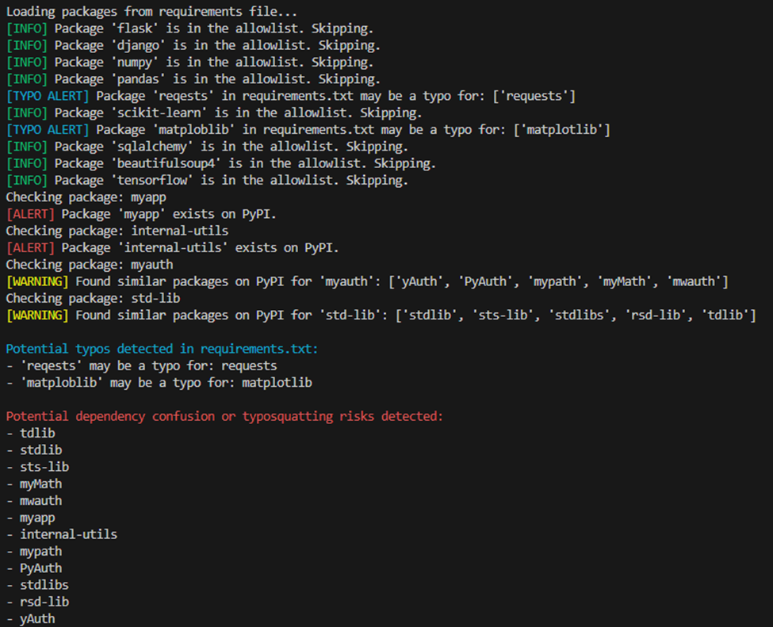
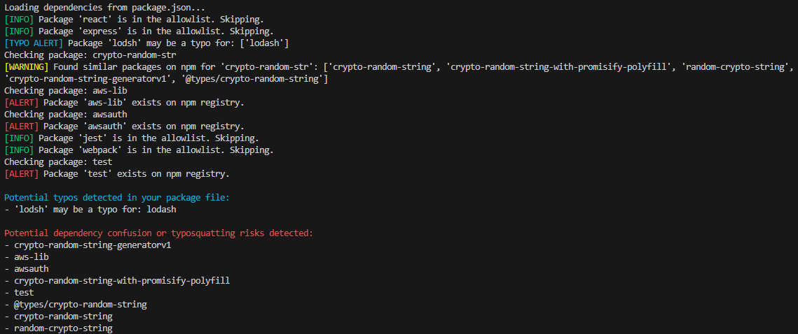

# DeCAF

## The Dependency Confusion Attack Finder (DeCAF) is a Python-based tool developed to help detect potential dependency confusion and typosquatting vulnerabilities in Python and JavaScript projects.

In early 2021, a security researcher named Alex Birsan discovered a novel supply chain attack vector called [dependency confusion](https://medium.com/@alex.birsan/dependency-confusion-4a5d60fec610). This attack exploits the way package managers resolve dependencies, potentially allowing malicious code to infiltrate software projects. DeCAF is a security tool designed to detect and mitigate dependency confusion and typosquatting vulnerabilities in both Python (pip) and JavaScript (npm) projects. By analyzing the project's dependencies, DECAF attempts to identify potential risks associated with malicious packages.

Note: Checking the names of internal dependencies on a package manager means sending that data over the wire. If you are risk averse to that, do not use this tool. Theoretically one could pull down the simple index from PyPI and check that, however, I'm not sure if a solution like that exists for other package managers.

## Usage:

### Command Line Arguments

**Required:** package_file: Path to the requirements.txt (for pip) or package.json (for npm) file.   
**Required:** --package-manager: Specify the package manager (pip or npm).  
-pm: alias for --package-manager  
--allowlist: (Optional) Path to the allowlist file. Defaults to allowlist.txt in the current directory  
-al: alias for --allowlist

### Example Usage

Pip:
> python decaf.py requirements.txt -al pip_allowlist.txt -pm pip

Npm:
> python decaf.py package.json -al npm_allowlist.txt -pm npm

The allowlist is a plain text file containing package names to exclude from alerts. It helps reduce false positives by ignoring known legitimate packages. Including the allowlist is optional. If an allowlist is not specified, DeCAF will attempt to find 'allowlist.txt' in the directory. To use a custom allowlist, just supply a path to the txt file.

Format: One package name per line.  
Comments: Lines starting with # are ignored.  
Case-Insensitive: Package names are compared in a case-insensitive manner.  

DeCAF also includes a sample requirements file, 'test_requirements.txt', and a sample 'test_package.json'.

## Output:

### [TYPO ALERT] (Cyan): Potential typos in requirements.txt.
### [ALERT] (Red): Exact package name exists on PyPI (dependency confusion risk).
### [WARNING] (Yellow): Similar package names found on PyPI (typosquatting risk).
### [INFO] (Green): Package is in the allowlist and skipped.

## Screenshots:
### pip

### npm

